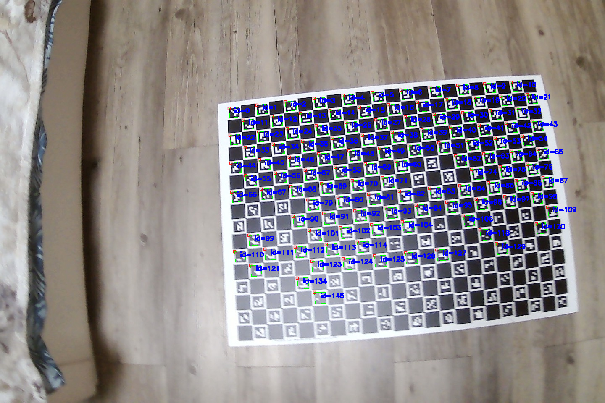

Implementation of [this lab](https://mim-ml-teaching.github.io/public-rc-2025-26/lab5-public/lab5.html)

Workflow:

* Run the helper `image_download.py` script.
This will automatically download
all images used in this homework and put them in appropriate
folders. The images are not included in the repository.

* Create a `camera_calibrator` and detect markers.
We can use to `run_detection_check` to see the detected markers.
In our run, all markers get detected, except in one image that is
partially blurred and only half the markers have been detected:

That is however acceptable for our purposes.