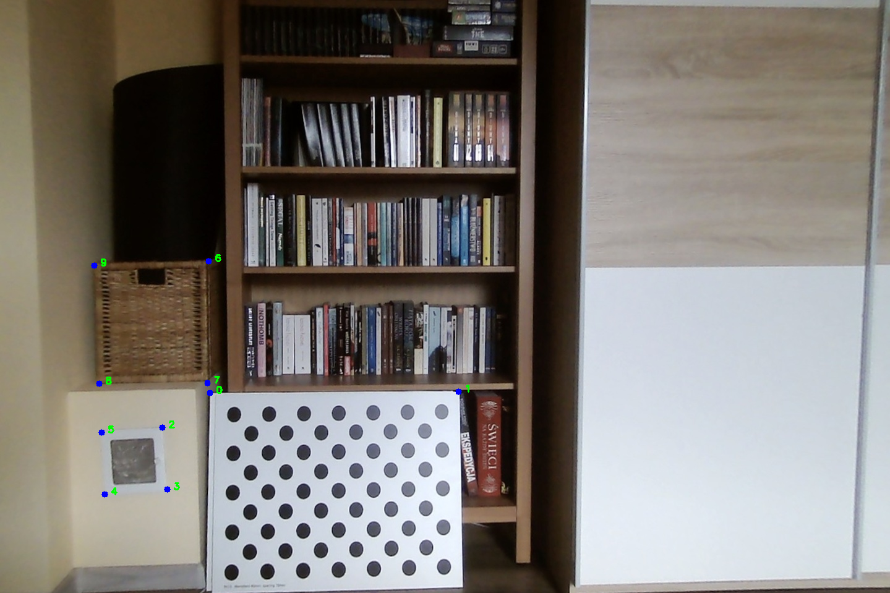
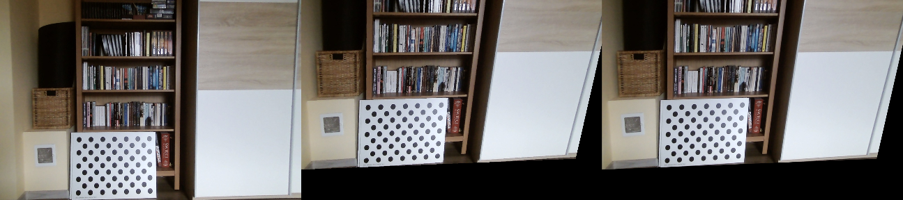

Implementation of [this lab](https://mim-ml-teaching.github.io/public-rc-2025-26/lab5-public/lab5.html)

Part 1: Camera calibration
---

Workflow:

* Run the helper `image_download.py` script.
This will automatically download
all images used in this homework and put them in appropriate
folders. The images are not included in the repository.

* In this lab, we are using images of a ChArUco board, so we
can use the appropriate OpenCV instruments for it, such as
the `interpolateCornersCharuco` functon.

* Create a `camera_calibrator` and detect markers.
We can use to `run_detection_check` to see the detected markers.
In our run, all markers get detected, except in one image that is
partially blurred and only half the markers have been detected:

That is however acceptable for our purposes.

* Further improvement with marker detection on the blurry image is unlikely.
We checked whether relaxing parameters (cornerRefinementWinSize, cornerRefinementMaxIterations, minMarkerPerimeterRate)
or converting image to grayscale would result in a significant improvement, but no difference
was found; these adjustments are not included in the final version of the code.

* There are two possible approaches here: go directly off the list
of ArUco markers or, with potentially higher accuracy, use the detection
specific for CharUco. We can try both approaches to compare.

* As `calibrateCameraAruco` and `calibrateCameraCharuco` no longer
exist for OpenCV 5.12 which is used for this lab, we can use `GridBoard.matchImagePoints`
instead in order to create object and image points in the format necessary for
the calibration.

* Importantly, we need to set up `setLegacyPattern(True)` is order for the calibration
to function (you can see a detailed explanation [here](https://stackoverflow.com/questions/73829313/opencv-interpolatecornerscharuco-giving-bad-estimation-when-board-is-partially)).
This is due to ChArUco boards design being changed, and us using a newer library.

* An alternative is to use camera calibration based only on markers 
rather than board corners, but that proved to be ineffective, leading to near-zero camera matrix.

* A visual test of the undistortion check has been run with the following result:

Parts 2-3: Projective transformation
---

We need to calculate a projected image based on the source image and the matrix.
For that, we can simply iterate over each destination pixel and, using the inverse
of the matrix, calculate the source pixel to take the colour from.

To find the homography matrix, we can create a matrix representing
the system of linear equations to solve and then find the least squares solution.

To test, we create a random set of source points, a random matrix, and calculate
the destination points by applying the matrix to them. We normalize the z-value of the
coordinate vector at each step. Then we restore the matrix and ensure it
matches the original one.

We repeat this 100 times to exclude the possibility of flakiness.

Parts 4: Manual projective transformation
---

(Note: `ginput` is not supported for PyCharm, which was used for this homework.)

To make our lives easier, we can bind the mouse click on the OpenCV preview
to a callback function. This won't give you sub-pixel coordinates, however,
this way, we can get more pair of points relatively effortlessly.

For example, by clicking, we can find the following coordinates in the first image of the first pair:

`[(340, 638), (743, 633), (261, 695), (270, 793), (169, 800), (165, 696), (335, 421), (337, 615), (157, 623), (152, 428)]`

For the second image, the same points have the coordinates:

`[(399, 788), (795, 797), (322, 847), (333, 937), (240, 941), (230, 850), (392, 585), (395, 765), (225, 763), (220, 581)]]`

For those two sets of points, we run the `find_homography` function from earlier.

An example result for the first pair - with original, our result, and the result
of using the standard OpenCV functions for comparison/ground truth:

Part 5: Image stitching 
---

Part 6: ORB & RANSAC
---