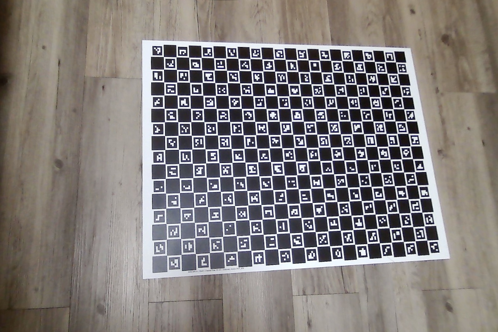

Implementation of [this lab](https://mim-ml-teaching.github.io/public-rc-2025-26/lab5-public/lab5.html)

Part 1: Camera calibration
---

Workflow:

* Run the helper `image_download.py` script.
This will automatically download
all images used in this homework and put them in appropriate
folders. The images are not included in the repository.

* In this lab, we are using images of a ChArUco board, so we
can use the appropriate OpenCV instruments for it, such as
the `interpolateCornersCharuco` functon.

* Create a `camera_calibrator` and detect markers.
We can use to `run_detection_check` to see the detected markers.
In our run, all markers get detected, except in one image that is
partially blurred and only half the markers have been detected:

That is however acceptable for our purposes.

* Further improvement with marker detection on the blurry image is unlikely.
We checked whether relaxing parameters (cornerRefinementWinSize, cornerRefinementMaxIterations, minMarkerPerimeterRate)
or converting image to grayscale would result in a significant improvement, but no difference
was found; these adjustments are not included in the final version of the code.

* There are two possible approaches here: go directly off the list
of ArUco markers or, with potentially higher accuracy, use the detection
specific for CharUco. We can try both approaches to compare.

* As `calibrateCameraAruco` and `calibrateCameraCharuco` no longer
exist for OpenCV 5.12 which is used for this lab, we can use `GridBoard.matchImagePoints`
instead in order to create object and image points in the format necessary for
the calibration.

* Importantly, we need to set up `setLegacyPattern(True)` is order for the calibration
to function (you can see a detailed explanation [here](https://stackoverflow.com/questions/73829313/opencv-interpolatecornerscharuco-giving-bad-estimation-when-board-is-partially)).
This is due to ChArUco boards design being changed, and us using a newer library.

* An alternative is to use camera calibration based only on markers 
rather than board corners, but that proved to be ineffective, leading to near-zero camera matrix.

* A visual test of the undistortion check has been run with the following result:

Part 2: Projective transformation
---

